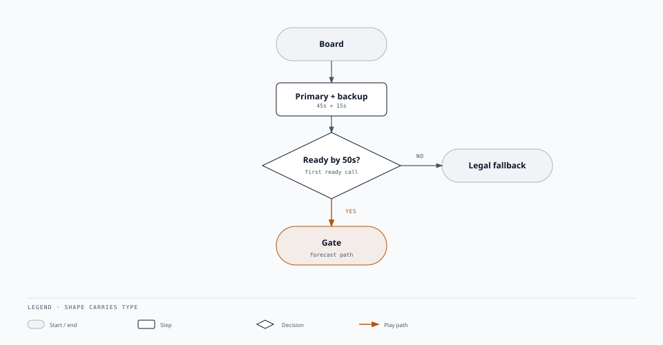
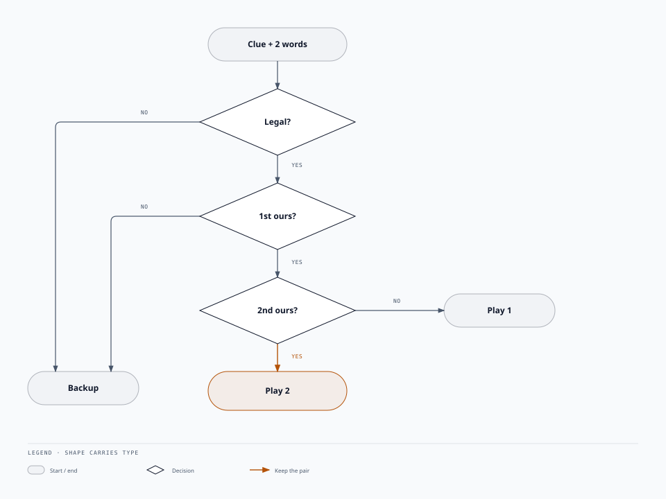
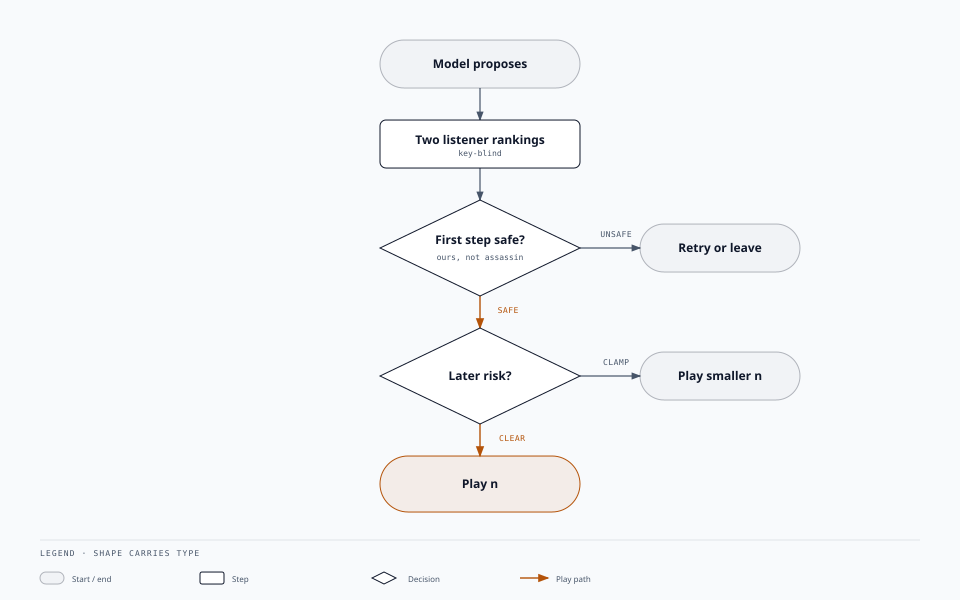

# Listener-gated clues — Team Edamame

**1st overall — IEEE CoG 2026 Codenames AI Competition.**
([Competition framework](https://github.com/stepmat/Codenames_GPT))

> **The model proposes. Code decides.**

An LLM can invent a clue, but its output should not go straight to the
board. Before a clue is announced, Python checks what a teammate is likely
to guess. It then plays the clue, reduces the guess count, or rejects it.

### [Play ClueCast →](https://codenames-agent-cluecast.vercel.app)

## What we borrowed

Google DeepMind's
[*Code World Models for General Game Playing*](https://arxiv.org/abs/2510.04542)
(Wolfgang Lehrach et al., 2025) separates model output from game action:
an LLM writes an executable world model, then search chooses the move.
We borrowed that separation—not the algorithm.

**We did**
- Treat every generated clue as a proposal.
- Check its predicted guess order against the hidden board labels.
- Let Python accept, shorten, or reject the proposal.

**We did not**
- Generate an executable game model.
- Run MCTS or search the clue space.
- Claim that the listener forecast is a Code World Model.


## Published here

- **[Team Edamame's CoG 2026 submission](submission/):** the frozen
  competition policy.
- **[ClueCast](https://codenames-agent-cluecast.vercel.app):** the improved
  online game, with two independent, key-blind listener simulations.

[Site](https://edamame-labs.github.io/codenames-agent-edamame/)
· [methodology](docs/METHODOLOGY.md)
· [eval](docs/EVALUATION.md)

## Details

### Competition submission

The scoring makes caution rational: a win is scored by clue count, a loss
scores 25, an illegal action can disqualify the entry, and a callback over
60 seconds fails. The agent therefore announces at most 2, never takes a
bonus guess, and always has a legal fallback.

A primary request (45s) and a backup request (15s) start together. The
agent waits at most 50 seconds for the primary, then uses a ready backup
or a deterministic legal clue.



The same model response contains both the clue and the teammate's first two
predicted guesses. Because that model can see the key, this is a forecast,
not an independent simulation. Python applies three rules:

- unsafe first guess → reject the clue;
- safe first guess, unsafe second guess → announce 1;
- two safe guesses → announce the proposed number, up to 2.



```bash
uv run python scripts/package_submission.py
```

Organizer install: [`submission/README.md`](submission/README.md).
Needs `OPENAI_API_KEY`. Nothing secret is in the repo.

### ClueCast

ClueCast has more time, so it uses a stronger gate. One model proposes a
clue and target set. Two independent, key-blind listener simulations rank
the board. Python combines their rankings, then retries an unsafe clue,
reduces its number when risk appears later, or plays it unchanged. After
three failed proposals, it leaves the turn unchanged.



`submission/` stays frozen. ClueCast loads it and wraps it.
Problem reports save a private, sanitized game log and email Team Edamame;
the game token and unrevealed labels are never included.

| | submission | ClueCast |
|---|---|---|
| clock | 50s, then legal fallback | 3 tries, then wait |
| numbers | 1 or 2 | leftover own cards |
| listener | same-call forecast, 2 words | two key-blind rankings |
| guesser | exact *n* | classic *n+1* |

## Run

```bash
uv sync
uv run python -m unittest discover -s tests -v
```

```bash
git clone https://github.com/stepmat/Codenames_GPT.git
export OPENAI_API_KEY="..."
uv run python evaluation/run_official.py \
  --framework ./Codenames_GPT \
  --mode single-self \
  --seed 3442
```

`--offline` checks wiring. Other modes: [eval](docs/EVALUATION.md).

MIT. [Notices](THIRD_PARTY_NOTICES.md).
