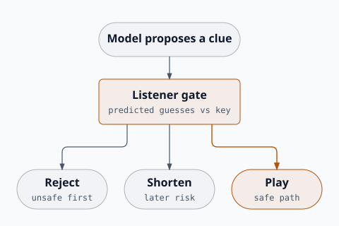

# Listener-gated clue methodology

This document describes Team **Edamame's submitted agent** for the
[CoG 2026 Codenames AI Competition](https://github.com/stepmat/Codenames_GPT)
and **ClueCast**, its improved online game. The public submission removes
the competition API key but preserves the playing policy.

Team Edamame placed 1st overall in the IEEE CoG 2026 Codenames AI
Competition.

> **The model proposes. Code decides.**

Google DeepMind's
[*Code World Models for General Game Playing*](https://arxiv.org/abs/2510.04542)
(Wolfgang Lehrach et al., 2025) implements that separation by having an
LLM write an executable world model and search choose the move. Our design
borrows the separation, not the algorithm.

The model proposes a clue. Python checks a predicted listener path against
the hidden key, then accepts, shortens, or rejects the proposal. The
submission does not generate game rules, run MCTS, or claim that its
forecast is a Code World Model. The official engine already supplies the
game rules.



## Competition constraints

The Codemaster sees the hidden labels; the Guesser does not. The submitted
agents also had to handle:

- unfamiliar words and teammates;
- immediate loss on the assassin;
- disqualification risk from invalid actions;
- a 60-second soft response limit;
- both Single-Team and Two-Team play.

These constraints favored a small, bounded pipeline over a multi-call search
system.

## Two worlds

The **rule world** is the official game engine. It defines legal actions,
reveals, turns, wins, and losses. Python can evaluate this world exactly.

The **listener world** is uncertain: given a clue, which board word will a
key-blind teammate choose? The submission asks the model to forecast the
first two guesses and checks that forecast against the real key.

It is only a two-step forecast, not a complete simulator.

## Codemaster

One model call returns:

```text
clue
number
targets
listener_first
listener_second
```

The call sees the hidden key. The listener fields are therefore a
counterfactual forecast from the same model, not an independent key-blind
agent.

### Validation

Python rejects a proposal unless:

- the clue is one alphabetic word and is legal for the live board;
- the number is 1 or 2;
- the target count matches the number;
- every target is a distinct live own card.

Malformed or illegal output is discarded rather than repaired.

### Listener gate

After validation, Python checks the forecast:

- unsafe first guess: reject the clue;
- safe first guess but unsafe second guess: change the number from 2 to 1;
- two safe guesses: keep the clue unchanged.

A forecast guess is treated as unsafe when it is the assassin, an opponent or
civilian card, or a word the model failed to name among the live board words.
A 2-clue is never played on an unverified second guess; it is shortened to 1.

For example, if `DOG` and `CAT` are ours and `TIGER` is the assassin:

- `TIGER → DOG`: reject;
- `DOG → TIGER`: use the clue for 1;
- `DOG → CAT`: use the clue for 2.

Only the final `(clue, number)` reaches the game engine.

### History

If a previous clue named two targets but produced only one own-card guess, its
remaining association stays in the public history supplied to later calls.

## Guesser

The Guesser receives no hidden labels. For each new clue it:

1. requests an ordered list of live words;
2. validates the list;
3. caches it for the rest of the turn;
4. stops after the announced number.

It does not take the optional `n+1` guess. A foreign clue numbered `0`
(unlimited under the framework) is treated as one guess.

## Latency and fallback

Each role starts two requests concurrently:

- primary: high reasoning, 45-second timeout;
- backup: fast response, 15-second timeout.

The whole callback has a 50-second wall-clock deadline. SDK retries are
disabled. At the deadline, the agent uses a ready backup or returns a
deterministic local fallback. The local fallback always returns a clue that is
legal for the current live board.

The Guesser backup returns only one word. This limits damage when the full
ranking is unavailable.

## Relation to Code World Models

DeepMind's Code World Models system:

1. observes game trajectories;
2. asks an LLM to generate executable Python rules;
3. tests and refines those rules;
4. plans actions with MCTS or ISMCTS.

The submission does none of those steps. The official framework already
provides the rules. The language model still names the candidate clue; code
decides whether that candidate may be announced.

The submission forecast is two words from the same key-aware call as the
clue, not an independent simulator. ClueCast is stronger: it uses two
key-blind rankings and combines them. Neither generates a world model or
searches over clues. A real CWM version would write an executable listener
simulator and search the clue space; these agents do not.

## Evidence

The development harness covered:

- Single-Team self-play;
- Single-Team with a foreign teammate;
- Two-Team self-play;
- Two-Team against another agent.

The preserved smoke sample contains one game per mode. All four were won, none
hit the assassin, and no callback exceeded 60 seconds. In the versus game,
three primary timeouts were covered by backups.

Four games verify wiring and fallback behavior. They do not estimate
tournament strength or reproduce the private competition results.

The repository also includes offline policy tests, secret checks, a
deterministic submission packager, and an official-framework runner. See the
[evaluation guide](EVALUATION.md).

## Limitations

- The listener forecast comes from the same key-aware call as the clue.
- It predicts only two guesses and provides no calibrated probabilities.
- The local morphology check is not a full English-language validator.
- Local fallbacks prioritize returning a legal action, not playing strength.
- The archived public evaluation is too small for statistical claims.

Useful ablations would remove the listener forecast, disable the gate, use an
independent key-blind listener, or remove the concurrent backup.

## References

1. StepMat,
   [Codenames AI Competition framework](https://github.com/stepmat/Codenames_GPT).
2. Wolfgang Lehrach et al.,
   Google DeepMind,
   [Code World Models for General Game Playing](https://arxiv.org/abs/2510.04542),
   2025.
